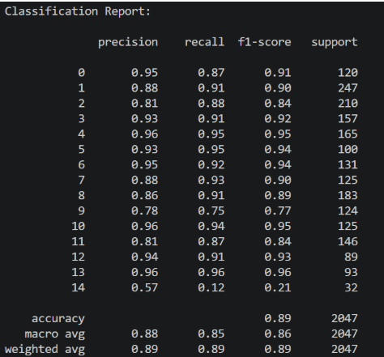
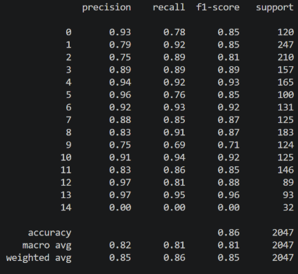
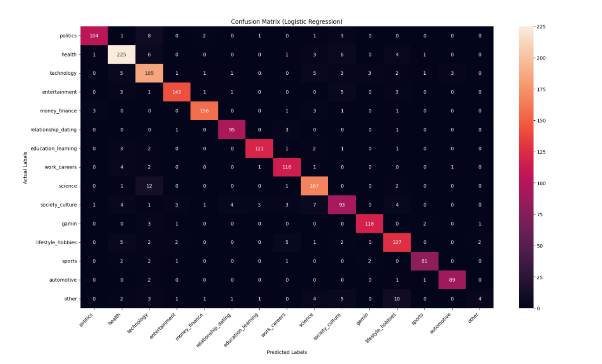

# Topic Classifier

A machine learning project that classifies tweets into predefined topic categories using Natural Language Processing (NLP).

We trained the models on a dataset of more than **10,000 labeled tweets across 15 topics**. We used TF-IDF to turn the tweet text into numerical features and compared two classification algorithms: **Logistic Regression** and **Multinomial Naive Bayes**.

Logistic Regression produced the best results, reaching approximately **89% accuracy**.

## How It Works

The classification process follows a few main steps:

1. Load and prepare the labeled tweet dataset
2. Preprocess the tweet text
3. Convert the text into numerical features using TF-IDF
4. Split the data into training and testing sets
5. Train the classification models
6. Evaluate and compare their performance

## Model Results

### Logistic Regression

Logistic Regression was the best-performing model, reaching approximately **89% accuracy**.



### Multinomial Naive Bayes

Multinomial Naive Bayes achieved approximately **86% accuracy**, giving us a second approach to compare against Logistic Regression.



### Confusion Matrix

We also used a confusion matrix to get a closer look at how the Logistic Regression model performed across the different topic categories.

This helped us see which topics were classified consistently and where the model was more likely to confuse similar categories.



## Model Comparison

| Model                   | Accuracy |
| ----------------------- | -------: |
| Logistic Regression     |     ~89% |
| Multinomial Naive Bayes |     ~86% |

Logistic Regression performed better on this dataset and was the stronger of the two approaches we tested.

## Tech Stack

- Python
- Pandas
- scikit-learn
- TF-IDF
- Logistic Regression
- Multinomial Naive Bayes
- Matplotlib

## Project Structure

```text
TopicClassifier/
│
├── python/
│   └── prep.py
│
├── screenshots/
│   ├── confusion-matrix-lg.png
│   ├── logistic-regression.png
│   └── multinomial-naive-bayes.png
│
├── TweetDataSplit/
│   ├── info.txt
│   └── train_data.csv
│
├── model.py
└── README.md
```

## Running the Project

Clone the repository:

```bash
git clone https://github.com/gabrielaiduarte/TopicClassifier.git
```

Navigate into the project:

```bash
cd TopicClassifier
```

Install the required packages:

```bash
pip install pandas numpy scikit-learn matplotlib
```

Run the model:

```bash
python model.py
```

## What We Learned

This project gave us experience working through the full process of a text classification problem, from preparing text data to training and evaluating machine learning models.

We worked with TF-IDF to represent text numerically and compared how different classification algorithms performed on the same dataset. The confusion matrix also helped us look beyond overall accuracy and understand where the model was making mistakes.

## Future Improvements

Some improvements that could be explored in the future:

- Hyperparameter tuning
- Additional text preprocessing
- Precision, recall, and F1-score comparisons by topic
- Cross-validation
- Additional classification algorithms
- A simple interface for entering a tweet and receiving a predicted topic
- Transformer-based NLP models

## Authors

**Gabriela Duarte**  
**Sam Spring**
